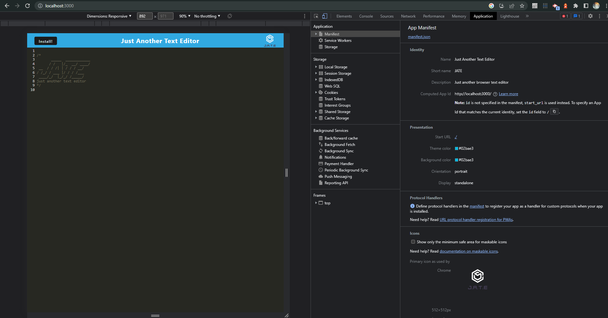
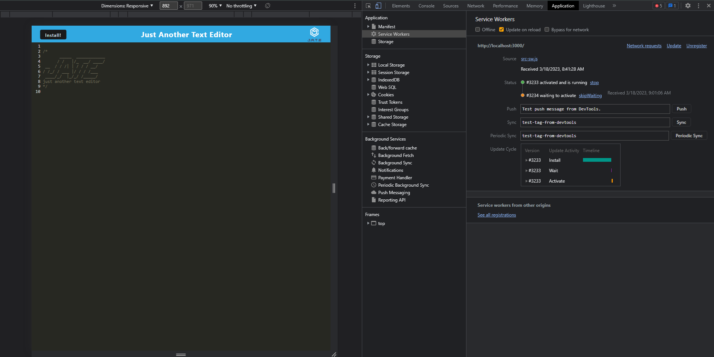
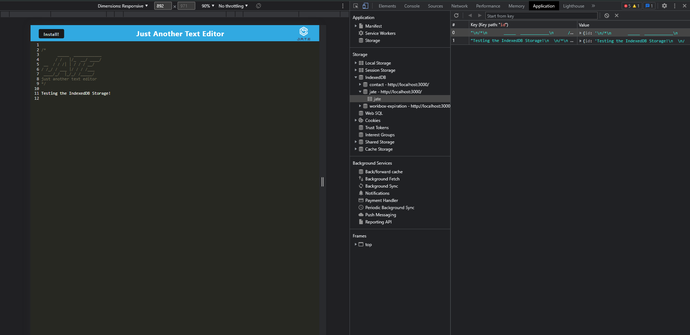

# Text-Editor-Application

## Description

This project is designed to create a working web page that offers a place to run a browser Text Editor with the capability of running offline as a PWA(Progressive Web Applciation). It utilizes IndexedDB which is an API designed to store more data based on the user's computer rather than local or session storage. 

## Insallation

To install this locally, you will need to use npm install

## Usage

This page will serve any and all users who want to use a text editor within their browser that not only saves their data in a high performance fasion but can also transfer to an offline application.

Below you will find screenshots displaying the functionality of this text editor.

[Check it out through Heroku!](https://jate-text-editor9.herokuapp.com/)

[To view more projects, click to visit my GitHub](https://github.com/Volexity21?tab=repositories)

## Credits

These questions were created and implimented by myself using knowledge from the Bootcamp and a variety of research sites such as W3Schools, Stack overflow, and MDN Webdocs.